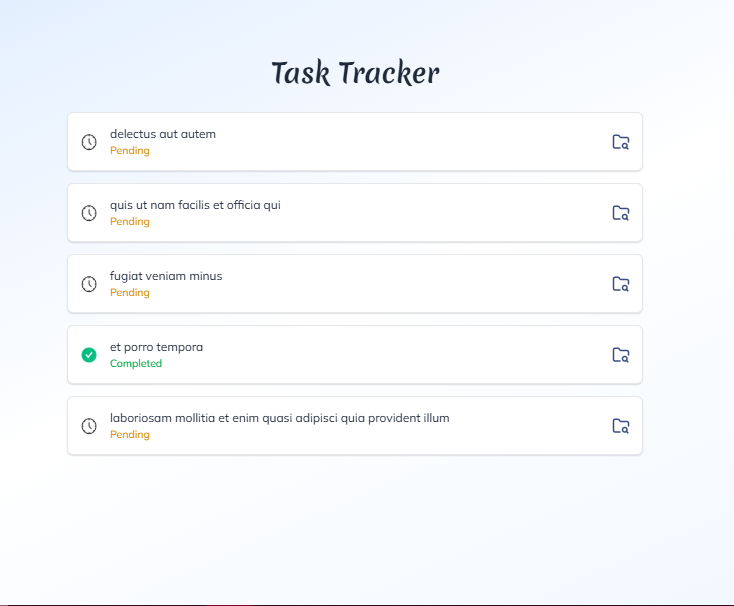
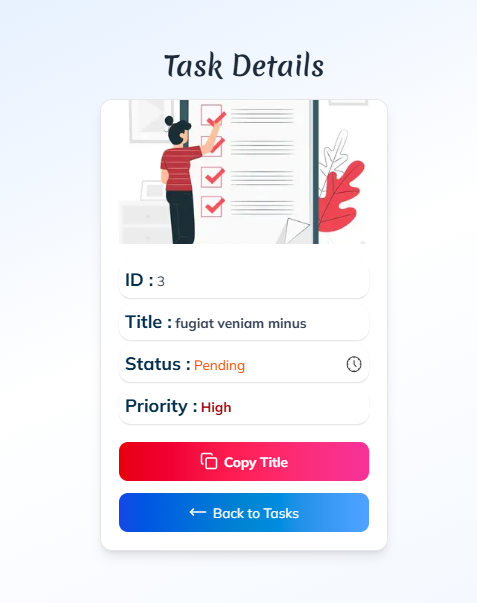

# Task Tracker Project 🗂️

This is a simple task tracker application where you can view, manage, and track the status of tasks. The project uses **React**, **Next.js**, and **TypeScript** to build a modern and user-friendly interface. It integrates with a mock API to fetch task data and allows you to interact with the application dynamically.

## Features 🚀

- 📋 Display a list of tasks
- 🔍 View task details (ID, title, status)
- 📋 Copy task title to clipboard
- 📱 Responsive design for all devices

## Technologies Used 🛠️

- **React** ⚛️: For building the user interface.
- **Next.js** 🌍: For server-side rendering and API routes.
- **TypeScript** ⌨️: For adding type safety and improving code quality.
- **React-hot-toast** 🔔: For showing success and error notifications.
- **Tailwind CSS** 🌈: For styling and building responsive layouts.
- **Lucide-react** 🔧: For using icons.
- **JSONPlaceholder API** 🔗: For mock task data.

## UI Preview 👀

### Homepage

### Task Detail Page

